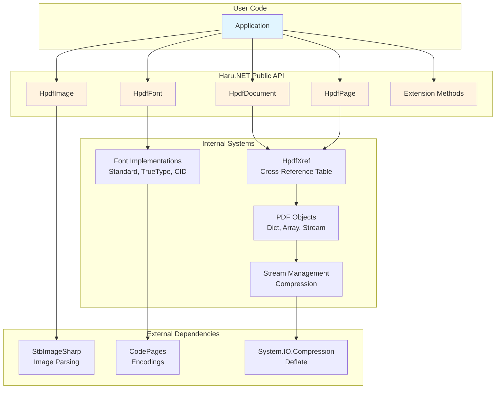
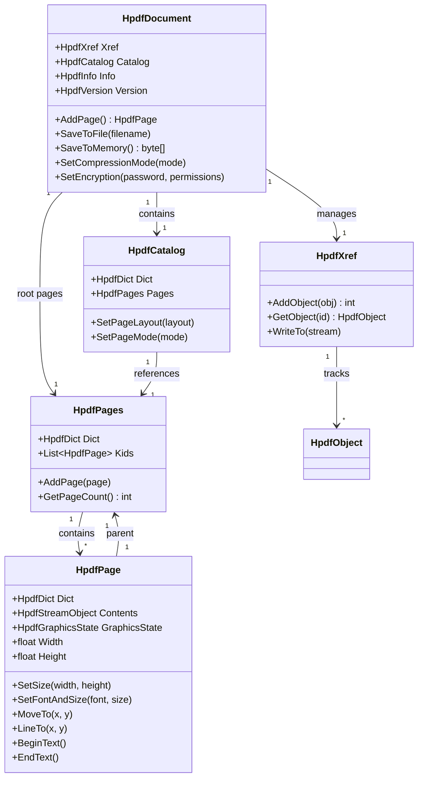
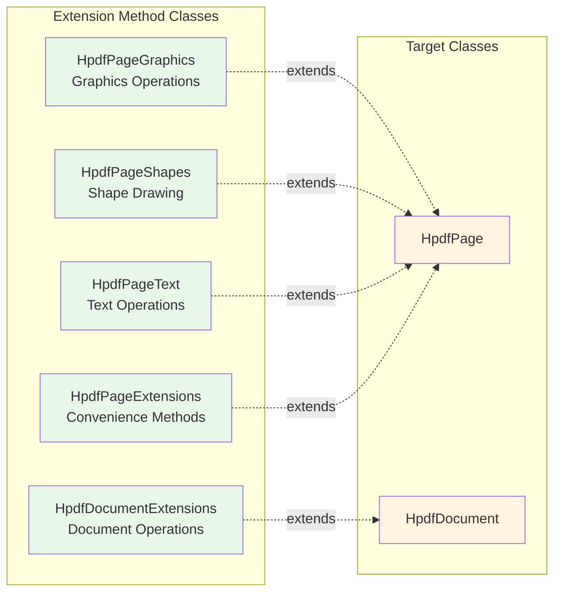
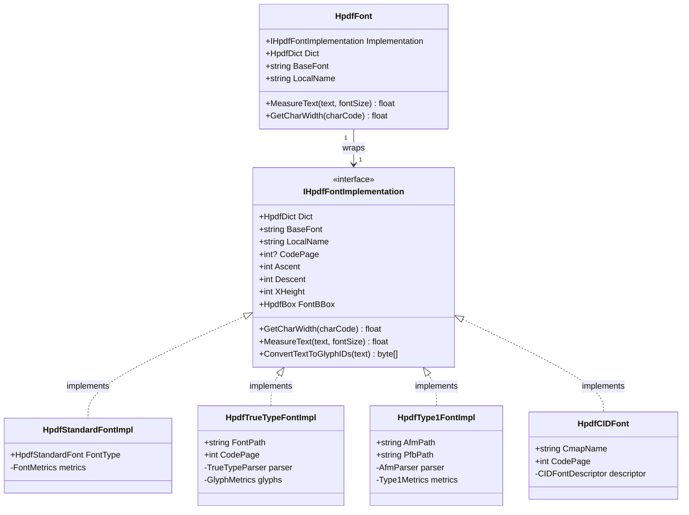
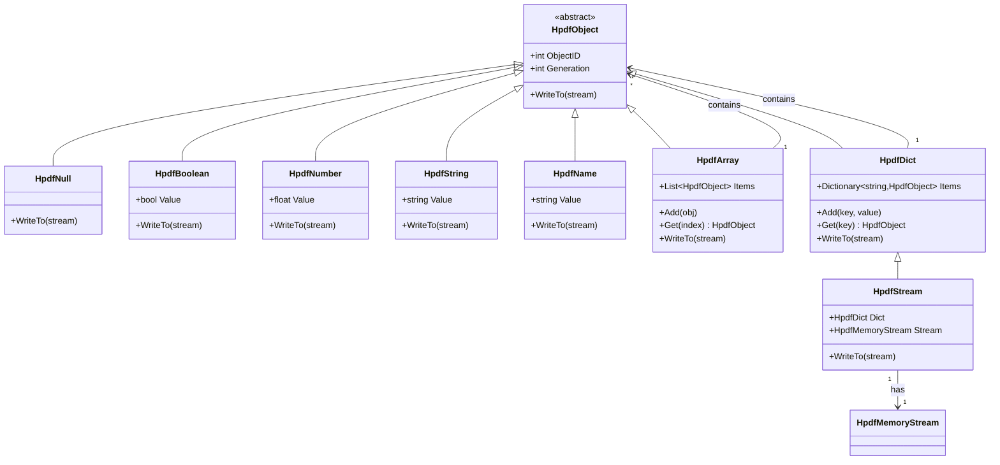
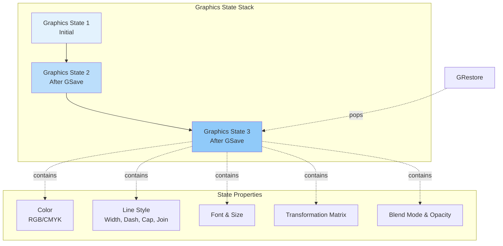
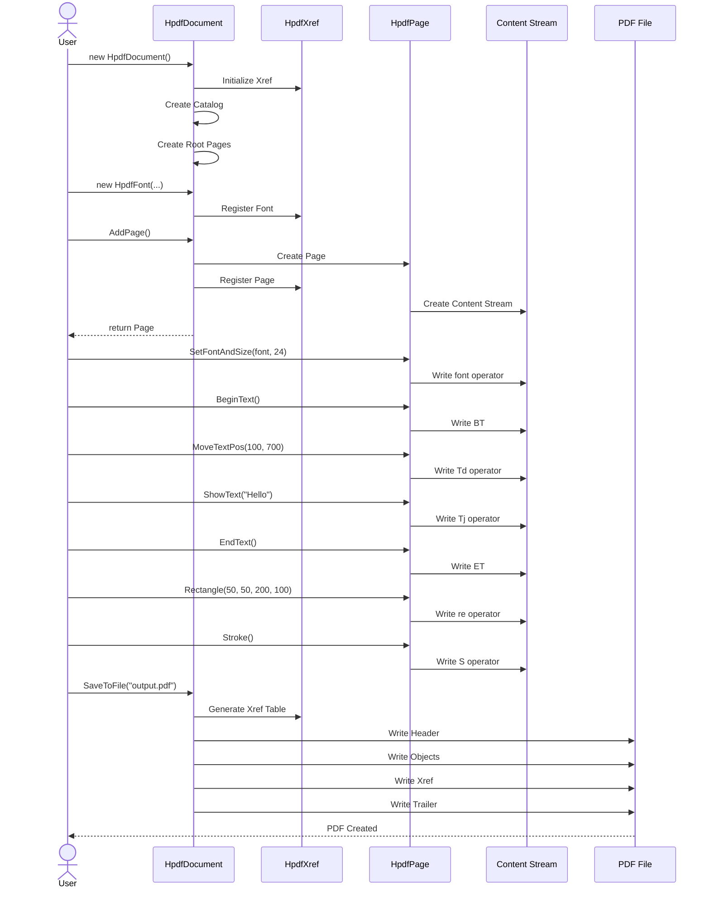
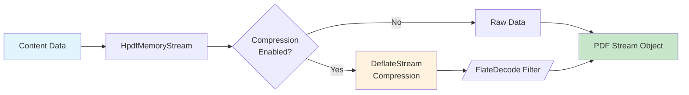
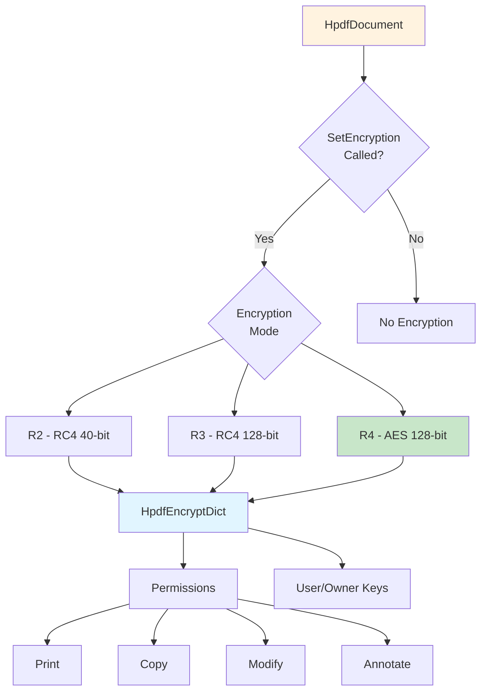

# Library Architecture

[← Back to Documentation Index](INDEX.md)

---

## Overview

Haru.NET is organized around a clean, hierarchical architecture that mirrors the PDF specification while providing a developer-friendly API. The library uses modern .NET design patterns including extension methods, polymorphic interfaces, and SOLID principles.

---

## High-Level Architecture

### System Overview



---

## Core Class Hierarchy

### Document Object Model



### Extension Methods Organization



**Extension Method Categories:**

- **HpdfPageGraphics** - Low-level graphics primitives
  - Path operations: `MoveTo`, `LineTo`, `CurveTo`, `Rectangle`, `Circle`, `Arc`
  - Color: `SetRgbStroke`, `SetRgbFill`, `SetCmykStroke`, `SetCmykFill`
  - Line styles: `SetLineWidth`, `SetLineCap`, `SetLineJoin`, `SetDash`
  - Transformations: `Concat`, `SetTextMatrix`
  - Path painting: `Stroke`, `Fill`, `FillStroke`, `Clip`
  - State: `GSave`, `GRestore`

- **HpdfPageShapes** - High-level shape drawing
  - `Circle(x, y, radius)`
  - `Ellipse(x, y, xRadius, yRadius)`
  - `Arc(x, y, radius, startAngle, endAngle)`

- **HpdfPageText** - Text operations
  - `BeginText`, `EndText`
  - `MoveTextPos(x, y)`
  - `ShowText(text)`
  - `ShowTextNextLine(text)`
  - `SetTextLeading(leading)`
  - `SetTextRenderingMode(mode)`

- **HpdfPageExtensions** - Convenience methods
  - `DrawImage(image, x, y, width, height)`

- **HpdfDocumentExtensions** - Document-level operations
  - `GetFont(fontPath, encoding)` - Load TrueType/Type1 fonts
  - `LoadPngImageFromFile(path)` - Load PNG images
  - `LoadJpegImageFromFile(path)` - Load JPEG images

---

## Font System Architecture

### Font Interface Hierarchy



### Font Types and Use Cases

| Font Type | Implementation | Use Case | Embedding | Code Pages |
|-----------|---------------|----------|-----------|------------|
| **Standard** | HpdfStandardFontImpl | Base14 PDF fonts | No | - |
| **TrueType** | HpdfTrueTypeFontImpl | Custom .ttf fonts | Yes | CP1251-1258 |
| **Type1** | HpdfType1FontImpl | PostScript fonts | Yes | Standard |
| **CID** | HpdfCIDFont | CJK languages | Yes | CP932, CP936, CP949, CP950 |

**Base14 Standard Fonts:**
- Times-Roman, Times-Bold, Times-Italic, Times-BoldItalic
- Helvetica, Helvetica-Bold, Helvetica-Oblique, Helvetica-BoldOblique
- Courier, Courier-Bold, Courier-Oblique, Courier-BoldOblique
- Symbol, ZapfDingbats

---

## PDF Object Hierarchy

### Object Model



**Object Types:**

- **HpdfNull** - PDF null object
- **HpdfBoolean** - PDF boolean (true/false)
- **HpdfNumber** - PDF numeric values (integer or real)
- **HpdfString** - PDF strings (literal or hexadecimal)
- **HpdfName** - PDF name objects (identifiers)
- **HpdfArray** - PDF arrays (ordered collections)
- **HpdfDict** - PDF dictionaries (key-value pairs)
- **HpdfStream** - PDF streams (dictionary + binary data)

---

## Graphics State Management

### Graphics State Structure



**Graphics State Properties:**

```csharp
public class HpdfGraphicsState
{
    // Color
    public HpdfRgbColor RgbStroke { get; set; }
    public HpdfRgbColor RgbFill { get; set; }
    public HpdfCmykColor CmykStroke { get; set; }
    public HpdfCmykColor CmykFill { get; set; }

    // Line style
    public float LineWidth { get; set; }
    public HpdfLineCap LineCap { get; set; }
    public HpdfLineJoin LineJoin { get; set; }
    public float MiterLimit { get; set; }
    public DashPattern Dash { get; set; }

    // Font
    public HpdfFont? Font { get; set; }
    public float FontSize { get; set; }

    // Text
    public float CharSpace { get; set; }
    public float WordSpace { get; set; }
    public float HorizontalScaling { get; set; }
    public float TextLeading { get; set; }
    public HpdfTextRenderingMode TextRenderingMode { get; set; }

    // Transformation
    public HpdfTransMatrix TransMatrix { get; set; }

    // Transparency
    public HpdfBlendMode BlendMode { get; set; }
    public float StrokeAlpha { get; set; }
    public float FillAlpha { get; set; }
}
```

---

## Document Creation Workflow

### Typical Document Creation Flow



---

## Type System

### Geometric Types

```csharp
// 2D Point
public struct HpdfPoint
{
    public float X { get; set; }
    public float Y { get; set; }
}

// Rectangle (x, y, width, height)
public struct HpdfRect
{
    public float X { get; set; }
    public float Y { get; set; }
    public float Width { get; set; }
    public float Height { get; set; }
}

// Bounding Box (left, bottom, right, top)
public struct HpdfBox
{
    public float Left { get; set; }
    public float Bottom { get; set; }
    public float Right { get; set; }
    public float Top { get; set; }
}

// 2D Transformation Matrix
public struct HpdfTransMatrix
{
    public float A { get; set; }  // Horizontal scaling
    public float B { get; set; }  // Vertical skewing
    public float C { get; set; }  // Horizontal skewing
    public float D { get; set; }  // Vertical scaling
    public float X { get; set; }  // Horizontal translation
    public float Y { get; set; }  // Vertical translation
}
```

### Color Types

```csharp
// RGB Color (0.0 to 1.0)
public struct HpdfRgbColor
{
    public float R { get; set; }
    public float G { get; set; }
    public float B { get; set; }
}

// CMYK Color (0.0 to 1.0)
public struct HpdfCmykColor
{
    public float C { get; set; }
    public float M { get; set; }
    public float Y { get; set; }
    public float K { get; set; }
}
```

### Page Types

```csharp
// Standard Page Sizes
public enum HpdfPageSize
{
    Letter,      // 612 x 792 points
    Legal,       // 612 x 1008 points
    A3,          // 842 x 1191 points
    A4,          // 595 x 842 points
    A5,          // 420 x 595 points
    B4,          // 729 x 1032 points
    B5,          // 516 x 729 points
    // ... more sizes
}

// Page Orientation
public enum HpdfPageDirection
{
    Portrait,
    Landscape
}
```

---

## Stream Processing

### Compression Pipeline



**Compression Modes:**

```csharp
[Flags]
public enum HpdfCompressionMode
{
    None = 0,
    Text = 1,      // Compress page content streams
    Image = 2,     // Compress image data
    Metadata = 4,  // Compress metadata streams
    All = 7        // Compress everything
}
```

---

## Encryption Architecture

### Encryption Flow



**Permission Flags:**

```csharp
[Flags]
public enum HpdfPermission
{
    Read = 0,
    Print = 4,
    Modify = 8,
    Copy = 16,
    Annotate = 32,
    FillForm = 256,
    Extract = 512,
    Assemble = 1024
}
```

---

## Design Patterns

### Patterns Used in Haru.NET

**1. Composite Pattern** - Document/Pages/Page hierarchy
```csharp
HpdfDocument → HpdfPages → HpdfPage (tree structure)
```

**2. Strategy Pattern** - Font implementations
```csharp
IHpdfFontImplementation → HpdfStandardFontImpl, HpdfTrueTypeFontImpl, etc.
```

**3. Builder Pattern** - Page content construction
```csharp
page.BeginText()
    .SetFontAndSize(font, 12)
    .MoveTextPos(100, 700)
    .ShowText("Hello")
    .EndText();
```

**4. Extension Method Pattern** - API organization
```csharp
static class HpdfPageGraphics extends HpdfPage
static class HpdfPageText extends HpdfPage
```

**5. Facade Pattern** - HpdfFont wraps IHpdfFontImplementation
```csharp
HpdfFont → IHpdfFontImplementation (simplified interface)
```

**6. Object Pool Pattern** - Xref table manages PDF objects
```csharp
HpdfXref tracks and reuses object IDs
```

---

## Porting from C to .NET

### Key Differences from Original C Library

| Aspect | C Library | .NET Port |
|--------|-----------|-----------|
| **Memory Management** | Manual malloc/free | Automatic GC |
| **Strings** | char* pointers | System.String |
| **Collections** | Manual arrays | List<T>, Dictionary<K,V> |
| **Compression** | zlib library | System.IO.Compression |
| **Error Handling** | Error codes | Exceptions |
| **Buffers** | Manual buffer management | Span<T>, Memory<T> |
| **Encoding** | Manual encoding | Encoding.GetEncoding() |

### .NET-Specific Enhancements

- **Fluent API** - Method chaining where appropriate
- **Properties** - C-style getters/setters converted to properties
- **Extension Methods** - Organized API without monolithic classes
- **Nullable Reference Types** - Compile-time null safety
- **Span<T>** - Efficient buffer operations without allocation
- **async/await** - Future enhancement for I/O operations

---

## Performance Considerations

### Optimization Strategies

**1. Object Reuse**
```csharp
// Good - reuse font across pages
var font = new HpdfFont(pdf.Xref, HpdfStandardFont.Helvetica, "F1");
foreach (var page in pages)
{
    page.SetFontAndSize(font, 12);
}
```

**2. Compression**
```csharp
// Enable compression for smaller files
pdf.SetCompressionMode(HpdfCompressionMode.All);
```

**3. Stream Writing**
```csharp
// Content streams write directly to memory
// No intermediate string allocations
```

**4. Font Metric Caching**
```csharp
// Font metrics loaded once and cached
// Fast text measurement operations
```

---

## Extending Haru.NET

### Adding Custom Functionality

**Custom Extension Methods:**

```csharp
public static class MyPageExtensions
{
    public static void DrawGrid(this HpdfPage page,
        float spacing, HpdfRgbColor color)
    {
        page.GSave();
        page.SetRgbStroke(color.R, color.G, color.B);
        page.SetLineWidth(0.5f);

        for (float x = 0; x < page.Width; x += spacing)
        {
            page.MoveTo(x, 0);
            page.LineTo(x, page.Height);
            page.Stroke();
        }

        for (float y = 0; y < page.Height; y += spacing)
        {
            page.MoveTo(0, y);
            page.LineTo(page.Width, y);
            page.Stroke();
        }

        page.GRestore();
    }
}
```

**Custom Font Implementation:**

```csharp
public class MyCustomFont : IHpdfFontImplementation
{
    public HpdfDict Dict { get; }
    public string BaseFont { get; }
    public string LocalName { get; }
    // ... implement interface methods
}
```

---

## Related Documentation

### Core Concepts
- [Quick Start Guide](USAGE.md) - Basic usage patterns
- [Getting Started](guides/GettingStarted.md) - Step-by-step tutorial

### Detailed Guides
- [Fonts Guide](guides/FontsGuide.md) - Font system in detail
- [Graphics Guide](guides/GraphicsGuide.md) - Graphics operations
- [Text Guide](guides/TextGuide.md) - Text rendering

### API Reference
- [HpdfDocument](api/core/HpdfDocument.md) - Document class reference
- [HpdfPage](api/core/HpdfPage.md) - Page class reference
- [HpdfFont](api/core/HpdfFont.md) - Font class reference

---

[← Back to Documentation Index](INDEX.md)

*Last updated: 2025-10-31*
